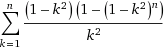

* PE40
> **Champernowne's constant**

* PE53
> double类型的能力：计算 n choose k

* PE61
> 还用到了dfs，有点意思。好像当时也是花了很大功夫的。

* PE75
> 整数边的直角三角形。解Pell方程能得到一个公式吧。
	a=m^2-n^2,b=m^2+n^2,c=2*m*n

* PE76, PE77
> 整数分划，素数分划。用动态规划求解。

* PE122
> 加法链问题，NP。求a^n的最少的乘法次数。快速幂的结果不一定最优。

* PE282
> **Ackermann Function** 求A(4,4),A(5,5),A(6,6)

* PE287
> Quadtree encoding

* PE375
> 查询区间内的最小值。线段树？

* PE179
> 1~10^7的所有数的约数个数。可以在O(nlog(n))时间复杂度内解决！

* PE336
> 11!次枚举，模拟。应该不难！
> Solved. 果然是暴力。不过Thread中有人用动态规划的，膜拜。

* PE483
> 置换群的分解

* PE479
> ~~公式推出了一半，根与系数的关系展开，最后得到， 然后算不动了。继续努力。~~ 
> 到这一步已经是最后了，剩下的就需要算了，用快速幂取模和扩展欧几里德。（第一次
> 竟然没想到，估计连推导带实现总共花费了超过四个小时。）

* PE216
> 当时用的是暴力，重新看下吧，官网上有pdf版本的解答！
